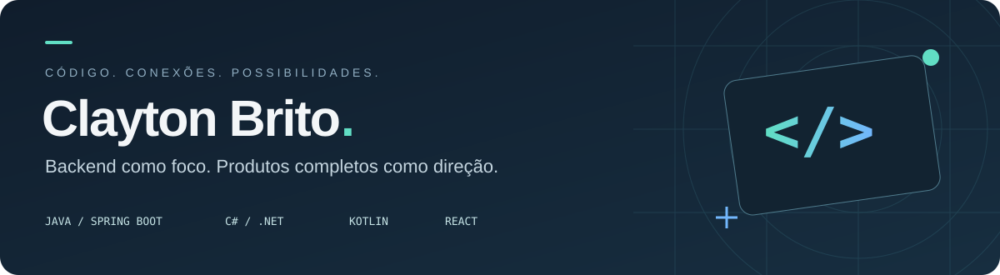

  

  <a href="https://ghostriley115.github.io/Jujubas-LandindPage/"><b>Portfólio Jujuba’s Dev ↗</b></a>
  &nbsp;·&nbsp;
  <a href="https://www.linkedin.com/in/claytondebrito"><b>LinkedIn ↗</b></a>
  &nbsp;·&nbsp;
  <a href="https://github.com/GhostRiley115?tab=repositories"><b>Repositórios ↗</b></a>

### Olá, eu sou o Clayton.

Desenvolvedor backend júnior, de São Paulo. Trabalho em projetos com **Java, Spring Boot e C#/.NET**, explorando também **Kotlin no Android** e **React na web** para conectar interfaces, APIs e dados.

Meu foco é transformar requisitos em aplicações: organizar regras de negócio, integrar serviços e construir experiências que façam sentido para quem usa. Aqui compartilho projetos acadêmicos e estudos práticos em desenvolvimento de sistemas.

**Em foco:** o ecossistema **Kiora**, desenvolvido no contexto do TCC, e a apresentação das soluções da **Jujuba’s Dev**.

---

### Projetos selecionados

<table>
<tr>
<td width="50%" valign="top">
<h3>01 · Kiora</h3>

Sistema web para restaurante, com catálogo, carrinho, pedidos, contas de usuário e administração. Projeto de TCC que conecta experiência do cliente e operação do negócio.

<code>C#</code> <code>ASP.NET Core</code> <code>Entity Framework</code> <code>MySQL</code>

<a href="https://github.com/GhostRiley115/KioraRestaurante"><b>Ver código</b></a> · <a href="https://kiorarestaurante.onrender.com"><b>Abrir site ↗</b></a>

</td>
<td width="50%" valign="top">
<h3>02 · Jujuba’s Dev</h3>

Portfólio da empresa fictícia do TCC. Identidade visual, temas claro e escuro, galeria interativa e apresentação das soluções Kiora e TechStart.

<code>React</code> <code>Vite</code> <code>JavaScript</code> <code>CSS</code>

<a href="https://github.com/GhostRiley115/Jujubas-LandindPage"><b>Ver código</b></a> · <a href="https://ghostriley115.github.io/Jujubas-LandindPage/"><b>Abrir site ↗</b></a>

</td>
</tr>
<tr>
<td width="50%" valign="top">
<h3>03 · Shopping Cart API</h3>

API REST de carrinho de compras, com itens, cálculo de total e fechamento do carrinho. Estudo de regras de negócio, relacionamentos e arquitetura em camadas.

<code>Java</code> <code>Spring Boot</code> <code>JPA</code> <code>H2</code>

<a href="https://github.com/GhostRiley115/shopping-cart-api"><b>Explorar API ↗</b></a>

</td>
<td width="50%" valign="top">
<h3>04 · Conversor de moedas Android</h3>

Aplicativo que consulta cotações por API e converte dólar, euro e peso argentino para reais. Integração HTTP e apresentação de resultados em uma interface nativa.

<code>Kotlin</code> <code>Android</code> <code>Retrofit</code> <code>Gson</code>

<a href="https://github.com/GhostRiley115/conversor-moeda-android-api"><b>Explorar aplicativo ↗</b></a>

</td>
</tr>
<tr>
<td width="50%" valign="top">
<h3>05 · TechStart — Desktop</h3>

Sistema interno com login, cadastro e gerenciamento de produtos e eventos. Interface Windows Forms e persistência local em um projeto acadêmico.

<code>C#</code> <code>.NET</code> <code>Windows Forms</code> <code>CRUD</code>

<a href="https://github.com/GhostRiley115/crud-desktop-app"><b>Explorar sistema ↗</b></a>

</td>
<td width="50%" valign="top">
<h3>06 · TechStart — Web</h3>

Landing page responsiva que apresenta a proposta da startup e seu sistema. Complementa a aplicação desktop com uma experiência pública de apresentação.

<code>HTML</code> <code>CSS</code> <code>JavaScript</code>

<a href="https://github.com/GhostRiley115/techstart-landing-page"><b>Ver código</b></a> · <a href="https://ghostriley115.github.io/techstart-landing-page/"><b>Abrir site ↗</b></a>

</td>
</tr>
</table>

### Tecnologias na prática

| Área | Tecnologias e conceitos |
| :--- | :--- |
| **Backend** | Java · Spring Boot · C# · ASP.NET Core · APIs REST · MVC |
| **Dados** | MySQL · SQL · Entity Framework · JPA/Hibernate · H2 |
| **Web** | React · JavaScript · HTML · CSS · Vite |
| **Mobile e desktop** | Kotlin · Android · Retrofit · Windows Forms |
| **Ferramentas** | Git · GitHub · GitHub Actions · Trello |

### Vamos conversar?

Para falar sobre desenvolvimento e trocar experiências, me encontre no **[LinkedIn](https://www.linkedin.com/in/claytondebrito)**. Para conhecer o lado visual dos projetos, visite o **[portfólio da Jujuba’s Dev](https://ghostriley115.github.io/Jujubas-LandindPage/)**.
